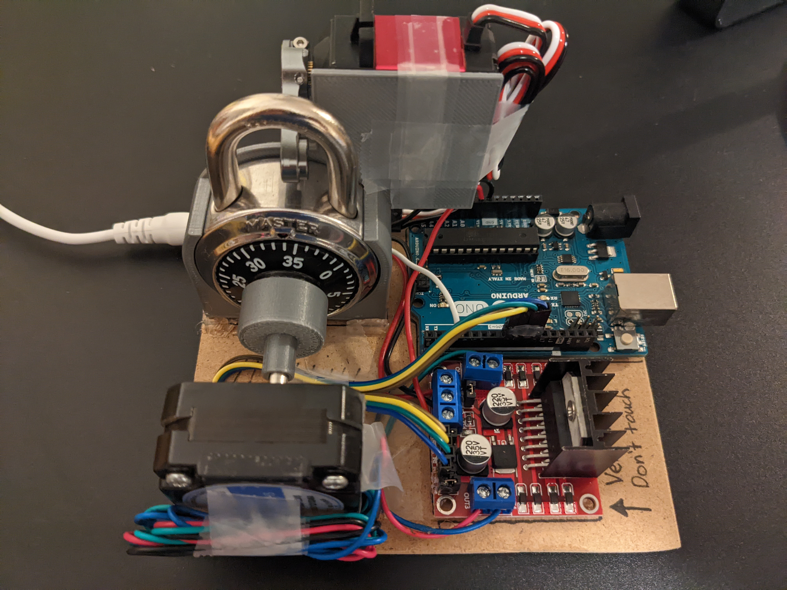
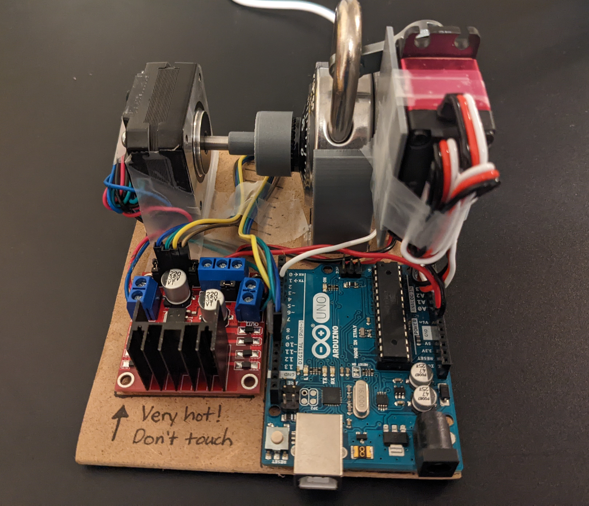
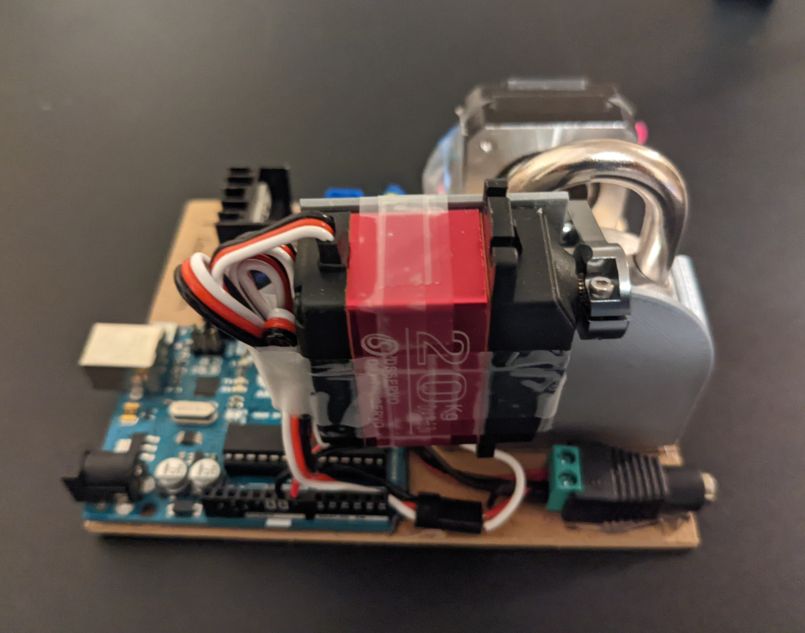

# arduino-combolock
This repository contains the arduino source code and documentation for a device that automatically unlocks a combination lock.

## YouTube video

## Motivation
My AP Physics C class had a "Rube Goldberg" project where the goal was to create a contraption with multiple transfers of energy all working in succession to complete a simple goal. (e.g. watering a plant, turning on a light bulb, making ramen noodles, etc.) Our group decided to unlock a combination lock for our final goal, so I built a simple arduino device that spins the dial and lifts the shackle.

## Parts
- Arduino Uno Rev3
- [20kg digital servo motor](https://www.amazon.com/gp/product/B076CNKQX4/ref=ppx_yo_dt_b_asin_title_o05_s00?ie=UTF8&psc=1)
- [Short Body Nema 17 Bipolar Stepper Motor](https://www.amazon.com/gp/product/B00PNEQ79Q/ref=ppx_yo_dt_b_asin_title_o04_s00?ie=UTF8&psc=1)
- [A4988 Stepper Motor Driver](https://www.amazon.com/gp/product/B07BND65C8/ref=ppx_yo_dt_b_asin_title_o03_s00?ie=UTF8&psc=1)
- 3D printed lock holder and dial adapter
- Other parts such as wires, and a lot of hot glue and tape

## Images

